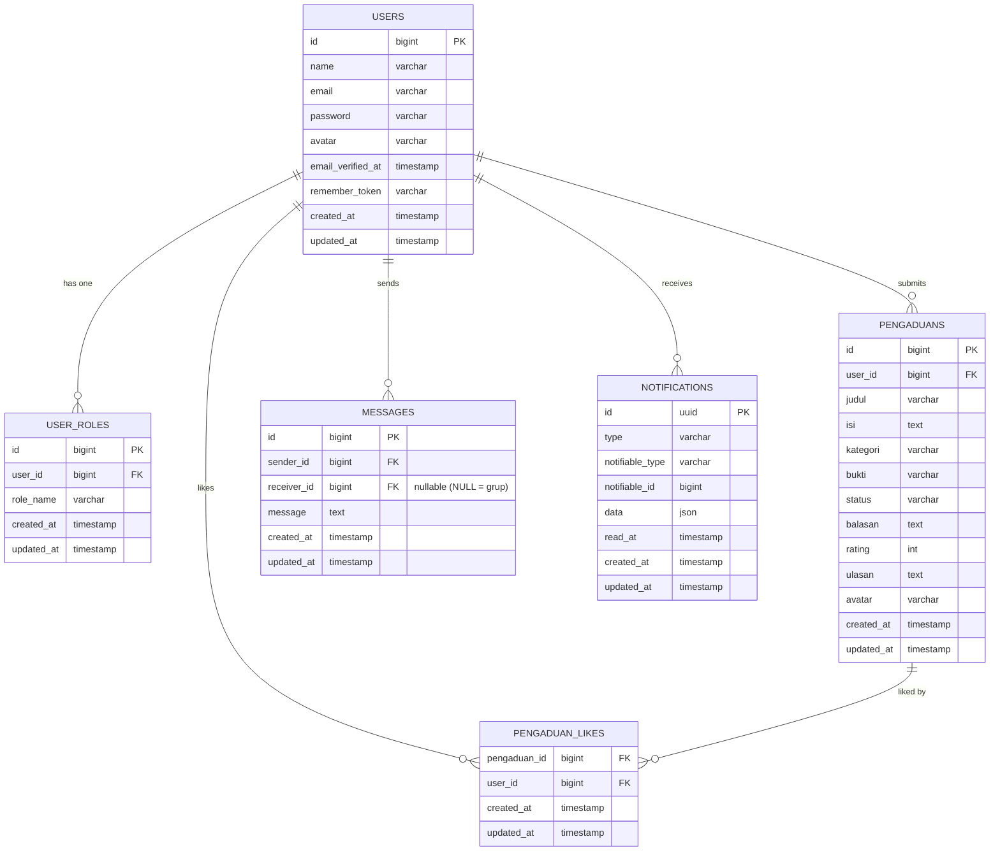

# 🎓 Analisis Codebase: E-Pengaduan Mahasiswa

## Gambaran Umum

Aplikasi **E-Pengaduan Mahasiswa** adalah sistem manajemen pengaduan berbasis web yang dibangun dengan **Laravel 11** (framework PHP). Aplikasi ini memungkinkan mahasiswa untuk mengajukan laporan/pengaduan, dan admin untuk mengelola serta merespons laporan tersebut.

**Tech Stack:**
| Komponen | Teknologi |
|---|---|
| Framework | Laravel 11 |
| Database | SQLite (file: `database/database.sqlite`) |
| Frontend CSS | Tailwind CSS + custom `dashboard.css` |
| Build Tool | Vite |
| Icon | Boxicons 2.1.4 |
| PDF Export | barryvdh/laravel-dompdf |
| Real-time Chat | Laravel Reverb (WebSocket) |
| Email | Laravel Mail (Mailable) |
| Notifikasi | Laravel Notifications (database channel) |

---

## 🗄️ Struktur Database (Migrations)

### Tabel Utama



### Status Pengaduan
- `pending` → baru diajukan
- `proses` / `diproses` → sedang ditangani admin
- `selesai` → sudah ada balasan

---

## 👤 Model & Relasi

### `User` → `app/Models/User.php`
- Extends `Authenticatable`, menggunakan `HasFactory`, `Notifiable`
- Relasi: `hasOne(UserRole)` via `userRole()`
- Field: `name`, `email`, `password`, `avatar`

### `UserRole` → `app/Models/UserRole.php`
- Tabel: `user_roles`
- Field: `user_id`, `role_name` (`admin` atau `mahasiswa`)
- Relasi: `belongsTo(User)`

### `Pengaduan` → `app/Models/Pengaduan.php`
- Field: `user_id`, `judul`, `isi`, `kategori`, `bukti`, `status`, `balasan`, `rating`, `ulasan`, `avatar`
- Relasi:
  - `belongsTo(User)` via `user()`
  - `belongsToMany(User)` via tabel `pengaduan_likes` → fitur dukungan/like

### `Message` → `app/Models/Message.php`
- Field: `sender_id`, `receiver_id` (nullable), `message`
- Menggunakan trait `Prunable` → auto-hapus pesan > 30 hari
- Relasi: `sender()` → User, `receiver()` → User
- `receiver_id = NULL` berarti pesan grup

---

## 🔀 Alur Routing (`routes/web.php`)

```
/                     → Welcome page (publik)
/dashboard            → Dashboard mahasiswa (auth + verified)
  ├── Jika role admin → redirect ke /admin/pengaduan
  └── Jika mahasiswa → tampilkan laporan miliknya

/profile              → Edit, Update, Delete profil (auth)

/pengaduan            → List pengaduan (auth) [via PengaduanController]
/pengaduan/create     → Form buat pengaduan lama (auth)
/pengaduan/store      → Simpan pengaduan lama (auth) ⚠️ ada dd() bug

/laporan-publik       → Semua laporan publik (auth)
/laporan/publik/{id}/like → Toggle like (auth)
/laporan/{id}/rating  → Submit rating bintang (auth)

/chat                 → Halaman live chat (auth)
/chat/messages/{id}   → Fetch pesan (JSON) [GET]
/chat/message         → Kirim pesan [POST]

/mahasiswa/laporan/buat    → Form laporan mahasiswa baru (role:mahasiswa)
/mahasiswa/laporan/simpan  → Simpan laporan (role:mahasiswa)
/mahasiswa/laporan/{id}    → Detail laporan mahasiswa

/admin/pengaduan      → Daftar semua laporan (admin)
/admin/pengaduan/{id} → Detail laporan (admin)
/admin/pengaduan/{id}/status → Update status (PUT, admin)
/admin/pengaduan/{id}/reply  → Balas laporan (PUT, admin)
/admin/export-pdf     → Export PDF (admin)
/admin/export-excel   → Export CSV/Excel (admin)
/admin/laporan/bersihkan → Hapus data lama > 6 bulan (POST, admin)

/admin/notifikasi/{id}/baca  → Tandai notif admin dibaca
/notifikasi/{id}/baca        → Tandai notif mahasiswa dibaca
```

---

## 🛡️ Middleware & Autentikasi

### `AdminMiddleware`
- Path: `app/Http/Middleware/AdminMiddleware.php`
- Cek: `Auth::user()->userRole->role_name === 'admin'`
- Jika bukan admin → redirect ke `/dashboard`

### Alur Login/Register
- Menggunakan Laravel Breeze (via `routes/auth.php`)
- Setelah login, pengecekan role di `/dashboard`:
  - `admin` → redirect ke `/admin/pengaduan`
  - `mahasiswa` → tampilkan dashboard mahasiswa

---

## 🎮 Controllers

### `AdminController` (`app/Http/Controllers/AdminController.php`)

| Method | Fungsi |
|---|---|
| `index()` | Tampilkan semua pengaduan dengan filter search/status/sort |
| `updateStatus()` | Update status + kirim notifikasi database + email |
| `show()` | Detail satu pengaduan |
| `reply()` | Balas pengaduan → otomatis ubah status jadi `selesai` |
| `exportPdf()` | Generate & download PDF via DomPDF |
| `exportExcel()` | Generate & download CSV dengan BOM UTF-8 |
| `bacaNotifikasi()` | Tandai notif sudah dibaca, redirect ke detail |
| `bersihkanDataLama()` | Hapus laporan `selesai` > 6 bulan beserta filenya |

### `LaporanController` (`app/Http/Controllers/Mahasiswa/LaporanController.php`)

| Method | Fungsi |
|---|---|
| `create()` | Tampilkan form laporan mahasiswa |
| `store()` | Simpan laporan + kirim notifikasi ke semua admin |
| `show()` | Detail laporan mahasiswa (popup) |
| `bacaNotifikasi()` | Tandai notif dibaca + redirect |
| `publik()` | Daftar semua laporan publik |
| `toggleLike()` | Like/unlike laporan |
| `rating()` | Simpan rating bintang + ulasan |

### `ChatController` (`app/Http/Controllers/ChatController.php`)

| Method | Fungsi |
|---|---|
| `index()` | Tampilkan daftar user untuk chat |
| `fetchMessages($id)` | Ambil riwayat pesan (personal atau grup jika id='group') |
| `sendMessage()` | Kirim pesan + broadcast via Laravel Reverb |

---

## 🔔 Sistem Notifikasi

### Alur Notifikasi Admin (Laporan Baru)
```
Mahasiswa submit laporan
  → LaporanController::store()
    → Cari semua user dengan role='admin'
      → Kirim LaporanBaruNotification (channel: database)
        → Tersimpan di tabel notifications
          → Lonceng admin menampilkan angka merah
```

### Alur Notifikasi Mahasiswa (Status Berubah)
```
Admin update status / balas laporan
  → AdminController::updateStatus() atau reply()
    → Kirim StatusLaporanNotification (channel: database)
      → Tersimpan di tabel notifications
        → Lonceng mahasiswa menampilkan angka merah
    → Jika status='selesai' → kirim LaporanSelesaiMail ke email mahasiswa
```

### Layout Notifikasi (main.blade.php)
- Ikon lonceng di navbar kanan atas
- Badge angka merah menunjukkan jumlah unread notifications
- Dropdown muncul saat diklik, menampilkan daftar notifikasi
- Klik notifikasi → tandai dibaca → redirect ke detail laporan

---

## 📧 Sistem Email

| Mail Class | Trigger | Isi |
|---|---|---|
| `LaporanSelesaiMail` | Admin reply / ubah ke 'selesai' | Pemberitahuan laporan selesai |
| `LaporanDiprosesMail` | (ada tapi jarang dipanggil) | Pemberitahuan laporan diproses |

---

## 💬 Sistem Live Chat (Real-time)

- Menggunakan **Laravel Reverb** (WebSocket server built-in Laravel)
- Event: `MessageSent` di-broadcast ke channel
- Chat support:
  - **Personal (1-on-1)**: `receiver_id` berisi ID user tujuan
  - **Grup**: `receiver_id = NULL`
- `Message` menggunakan trait `Prunable` → auto-hapus pesan > 30 hari

---

## 🖼️ Views & Layout

### Layout Utama: `layouts/main.blade.php`
- Sidebar kiri dengan navigasi role-based:
  - Admin: Dashboard → Laporan Publik → Live Chat
  - Mahasiswa: Dashboard → Buat Laporan → Pengaduan Saya → Laporan Publik → Live Chat
- Navbar atas: Dark mode toggle, Notifikasi (lonceng), Avatar profil
- Dark mode disimpan di `localStorage` dan diterapkan sebelum render (anti-flicker)
- Yield: `@yield('title')`, `@yield('konten_utama')`, `@stack('styles')`

### Halaman Views

| Path | Deskripsi |
|---|---|
| `welcome.blade.php` | Landing page publik |
| `dashboard.blade.php` | Dashboard mahasiswa (tabel laporan + statistik) |
| `admin/index.blade.php` | Daftar semua laporan untuk admin |
| `admin/detail.blade.php` | Detail laporan + form balas (admin) |
| `admin/pdf.blade.php` | Template khusus untuk export PDF |
| `mahasiswa/show.blade.php` | Detail laporan mahasiswa (popup) |
| `mahasiswa/laporan/` | Form buat laporan mahasiswa |
| `pengaduan/` | (Fitur lama, masih ada) |
| `chat/index.blade.php` | Halaman live chat |
| `profile/` | Halaman edit profil |
| `auth/` | Login, Register (Breeze) |

---

## ⚠️ Bug & Masalah Ditemukan

> [!CAUTION]
> **Bug Kritis #1 — `dd()` di PengaduanController::store()**
> 
> File: [`PengaduanController.php`](file:///c:/Users/MyBook%20Hype%20AMD/Videos/Captures/Code%20sekripsi/pengaduan-mahasiswa/app/Http/Controllers/PengaduanController.php#L25)
>
> ```php
> public function store(Request $request)
> {
>     dd($request->all()); // ← INI AKAN MENGHENTIKAN EKSEKUSI!
>     $request->validate([...]);
> ```
> Akibat: Form pengaduan lama tidak bisa disubmit sama sekali. Ini tampaknya kode debug yang terlupa dihapus.

> [!CAUTION]
> **Bug Kritis #2 — Dead code di `AdminController::index()`**
>
> File: [`AdminController.php`](file:///c:/Users/MyBook%20Hype%20AMD/Videos/Captures/Code%20sekripsi/pengaduan-mahasiswa/app/Http/Controllers/AdminController.php#L65-L66)
>
> ```php
> return view('admin.index', ...); // ← return di sini
> 
> dd($pengaduan->user); // ← INI TIDAK AKAN PERNAH DIEKSEKUSI
> $pengaduan->user->notify(new StatusLaporanNotification($pengaduan));
> ```
> Baris `dd()` dan `notify()` setelah `return` tidak akan pernah berjalan.

> [!WARNING]
> **Masalah #3 — Notifikasi Admin mencari via kolom `role` (bukan relasi)**
>
> File: [`LaporanController.php`](file:///c:/Users/MyBook%20Hype%20AMD/Videos/Captures/Code%20sekripsi/pengaduan-mahasiswa/app/Http/Controllers/Mahasiswa/LaporanController.php#L47)
>
> ```php
> $admins = \App\Models\User::where('role', 'admin')->get();
> ```
> Padahal sistem role disimpan di tabel `user_roles` terpisah (via relasi `userRole`). Kolom `role` tidak ada di tabel `users`, sehingga notifikasi ke admin tidak akan terkirim.
>
> **Fix yang benar:**
> ```php
> $admins = \App\Models\User::whereHas('userRole', function($q) {
>     $q->where('role_name', 'admin');
> })->get();
> ```

> [!WARNING]
> **Masalah #4 — Route duplikat**
>
> Di `web.php` terdapat dua definisi route yang sama:
> ```php
> Route::get('/admin/pengaduan', [AdminController::class, 'index'])->name('admin.index');
> Route::get('/admin/laporan', [AdminController::class, 'index'])->name('admin.index'); // ← name duplikat!
> ```
> Dua route menggunakan nama `admin.index` yang sama. Ini bisa menyebabkan helper `route('admin.index')` menghasilkan URL yang tidak konsisten.

> [!NOTE]
> **Catatan #5 — PengaduanController vs LaporanController**
>
> Ada dua controller yang fungsinya tumpang tindih:
> - `PengaduanController` → sistem pengaduan lama (tapi fungsi `store()` diblokir `dd()`)
> - `LaporanController` → sistem laporan baru yang aktif digunakan
>
> `PengaduanController` sepertinya akan digantikan sepenuhnya oleh `LaporanController`.

---

## 🔄 Alur Lengkap Penggunaan Aplikasi

```
[MAHASISWA]                           [ADMIN]
    │                                     │
    ├─ Register/Login                     ├─ Login
    │                                     │
    ├─ Dashboard                          ├─ Dashboard Admin
    │   ├─ Lihat statistik laporan        │   ├─ Lihat semua laporan
    │   ├─ Cari/filter riwayat laporan    │   ├─ Search/filter/sort laporan
    │   └─ Klik "Lihat Detail"            │   ├─ Update status dropdown
    │                                     │   ├─ Klik "Detail" → balas laporan
    ├─ Buat Laporan Baru                  │   ├─ Export PDF / Export CSV
    │   ├─ Isi judul, isi, kategori       │   └─ Bersihkan data lama > 6 bulan
    │   ├─ Upload bukti (opsional)        │
    │   └─ Submit → notif ke admin        │
    │                                     │
    ├─ Laporan Publik                     │
    │   ├─ Lihat semua laporan            │
    │   └─ Like/unlike laporan            │
    │                                     │
    ├─ Lihat Detail Laporan Sendiri       │
    │   ├─ Lihat balasan admin            │
    │   └─ Beri rating + ulasan           │
    │                                     │
    ├─ Live Chat                          ├─ Live Chat
    │   ├─ Chat personal (1-on-1)         │   ├─ Chat personal
    │   └─ Chat grup                      │   └─ Chat grup
    │                                     │
    └─ Profil                             └─ Profil
        ├─ Edit nama/email                    ├─ Edit nama/email
        └─ Ganti foto avatar                 └─ Ganti foto avatar
```

---

## 📁 Struktur Folder Penting

```
pengaduan-mahasiswa/
├── app/
│   ├── Events/MessageSent.php          # Broadcast event chat
│   ├── Http/
│   │   ├── Controllers/
│   │   │   ├── AdminController.php     # Semua logika admin
│   │   │   ├── ChatController.php      # Real-time chat
│   │   │   ├── PengaduanController.php # Pengaduan (lama, ada bug dd())
│   │   │   ├── ProfileController.php   # Edit profil & avatar
│   │   │   └── Mahasiswa/
│   │   │       └── LaporanController.php # Laporan mahasiswa (aktif)
│   │   └── Middleware/
│   │       └── AdminMiddleware.php     # Proteksi route admin
│   ├── Mail/
│   │   ├── LaporanSelesaiMail.php
│   │   └── LaporanDiprosesMail.php
│   ├── Models/
│   │   ├── User.php
│   │   ├── UserRole.php
│   │   ├── Pengaduan.php
│   │   └── Message.php
│   └── Notifications/
│       ├── LaporanBaruNotification.php  # Notif ke admin
│       └── StatusLaporanNotification.php # Notif ke mahasiswa
├── database/
│   ├── database.sqlite                  # File database SQLite
│   └── migrations/                      # 11 migration files
├── resources/views/
│   ├── layouts/main.blade.php           # Layout utama (sidebar + navbar)
│   ├── dashboard.blade.php              # Dashboard mahasiswa
│   ├── welcome.blade.php                # Landing page
│   ├── admin/                           # View admin
│   ├── mahasiswa/                       # View mahasiswa
│   ├── chat/                            # View live chat
│   └── profile/                         # View profil
└── routes/
    ├── web.php                          # Semua route utama
    └── auth.php                         # Route auth (Breeze)
```
